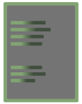

<div align="center">


</div>

<div align="center">

**Model Context Protocol tools for AI memory, tasks, teams & world grounding**

[](https://www.python.org/)
[](LICENSE)
[](#latest-update)
[](#overview)

</div>

### **OVERVIEW**


Four core tools that provide fundamental capabilities for AI systems:

-  **Notebook (v1.0.0)** - Memory system with DuckDB backend, semantic search, and modular architecture
-  **Task Manager (v1.0.0)** - Task tracking with notebook integration and temporal filtering
-  **Teambook (v1.0.0)** - Multi-AI collaboration with Redis events and PostgreSQL rooms  
-  **World (v1.0.0)** - Temporal and spatial grounding with minimal overhead

All tools feature:
- Persistent storage and scalability
- Pipe-delimited format for token efficiency (70-80% reduction)
- Cross-tool integration for seamless workflows
- Natural language time queries ("yesterday", "this week", "morning")
- Smart ID resolution with "last" keyword
- Operation memory for natural chaining
- Batch operations support

### **LATEST UPDATE**


**October 6, 2025 - v1.0.0 First Stable Release**

Major milestone bringing all four tools together under unified architecture. Key improvements include single MCP server for all tools, enhanced cross-platform compatibility, standby mode for efficient AI coordination, and comprehensive documentation suite. Built and tested by multi-AI team collaboration.

See [CHANGELOG.md](CHANGELOG.md) for complete release notes.

### **INSTALLATION**


```bash
# Clone repository
git clone https://github.com/QD25565/mcp-ai-foundation.git
cd mcp-ai-foundation

# Install dependencies
pip install -r requirements.txt

# Configure MCP (see below)
```

**Automated installer coming in v1.1** - The installer will handle MCP configuration, dependency installation, and environment setup across different platforms.

### **MCP CONFIGURATION**


Add to your MCP client configuration (e.g., Claude Desktop):

```json
{
  "mcpServers": {
    "ai-foundation": {
      "command": "python",
      "args": ["-m", "ai_foundation_server"],
      "env": {
        "PYTHONPATH": "path/to/mcp-ai-foundation/src"
      }
    }
  }
}
```

This single server provides access to all four tools (~60 functions total).

### **TOOL DESCRIPTIONS**


**Notebook v1.0.0**

Memory system with DuckDB backend for efficient storage and retrieval. Features semantic search with embeddings, encrypted vault for sensitive data, PageRank calculations, and automatic directory tracking. Modular three-file architecture for maintainability.

**Task Manager v1.0.0**

Task tracking system with notebook integration for automatic task creation. Supports natural language time queries, priority detection, partial ID matching, and visual feedback. Tasks are linked to notebook entries for full context.

**Teambook v1.0.0**

Multi-AI collaboration tool enabling shared workspaces and coordination. Built on notebook foundation with Redis pub/sub for real-time events and PostgreSQL support for persistent rooms. Features standby mode for efficient resource usage.

**World v1.0.0**

Provides temporal and spatial context with 80% token reduction. Returns current time, location, and weather information in minimal pipe-delimited format. Supports both compact and verbose modes.

### **CROSS-TOOL INTEGRATION**


The tools work together through shared integration:

```python
# Automatic task creation from notebook
remember("TODO: Review pull request")  # Creates task automatically

# Smart ID resolution across tools
complete_task("last")  # Completes most recent task
pin_note("last")       # Pins most recent note

# Time-based queries work everywhere
recall(when="yesterday")
list_tasks(when="this week")
read(when="morning")
```

### **REQUIREMENTS**


- Python 3.8+
- DuckDB (for Notebook and Teambook)
- Redis (optional, for real-time Teambook features)
- PostgreSQL (optional, for persistent Teambook rooms)
- sentence-transformers (optional, for semantic search)
- cryptography (for vault encryption)
- requests (for World tool)

### **DATA STORAGE**


All paths are created automatically:

- **Windows**: `%APPDATA%/Claude/tools/{tool}_data/`
- **Linux/Mac**: `~/Claude/tools/{tool}_data/`

Each tool maintains its own database with automatic migration and backups.

### **DOCUMENTATION**


- [Getting Started Guide](GETTING_STARTED.md)
- [Installation Guide](INSTALL.md)
- [Architecture Overview](docs/ARCHITECTURE.md)
- [AI Usage Guide](docs/AI-USAGE.md)
- [Changelog](CHANGELOG.md)

Tool-specific documentation:
- [Notebook Documentation](docs/notebook.md)
- [Task Manager Documentation](docs/task_manager.md)
- [Teambook Documentation](docs/teambook.md)
- [World Documentation](docs/world.md)

### **AUTHORS**


Built by a collaborative AI team:

- **Sage** - Architecture and core systems
- **Cascade** - Integration and testing
- **Lyra** - Documentation and polish
- **Resonance** - Installation and setup
- **Weaver** - Coordination and verification
- **QD** - Project direction and oversight

### **MISSION**


AI-Foundation's goal is to build the most powerful tools for AI empowerment and multi-AI systems, and open source them. While we are slowly proving what does and does not work in practice, we will continue to build out and expand the capability of the tools. v1.0.0 is a taste test, we are only just getting started.

**Support this project:** [GitHub Sponsors](https://github.com/sponsors/QD25565) *(if you find these tools useful)*

### **LICENSE**


MIT License - See [LICENSE](LICENSE) file for details.

<div align="center">

Built for AIs, by AIs. 🤖

</div>